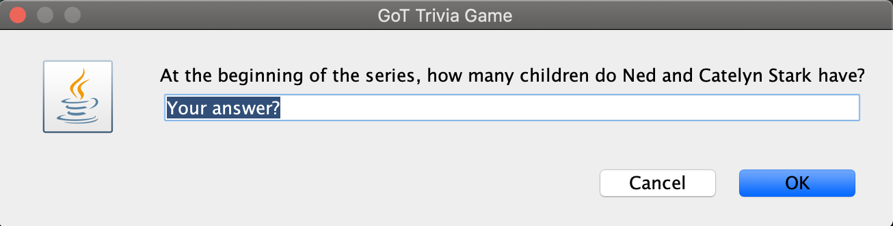

# Object Oriented Programming with Web-Based Applications

These are the programs for CMPSC221 at Penn State University. The GoT Trivia program utilizes JOptionPane from swing to make a GUI.

## Packages and Imports

```Java
package qanda;
import java.util.*;
import javax.swing.JOptionPane;
```

## Screen Shots from GoT Trivia:

    The Welcome GUI when running the program:


    A sample question from GoT:



